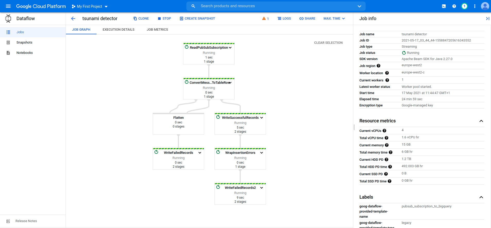
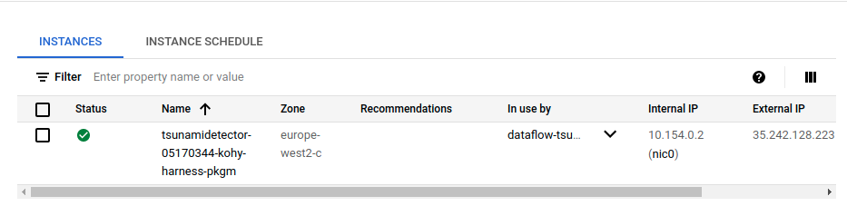
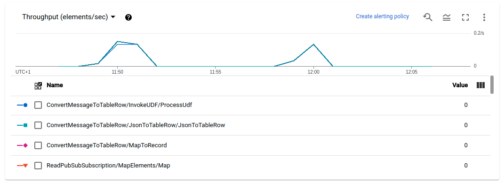

# Process and Enrich Data

## Milestone 2 - Write a Cloud Dataflow Pipeline to Apply the Transformation to the Raw Data

Created a bucket with:

    gsutil mb -l eu -p pure-album-313018  gs://fernando-bernardino

### This is the Jub running:

### And corresponding VM instance:

This is the throughput graph from the Job, after I ran twice the simulator
to generate 10 messages:
