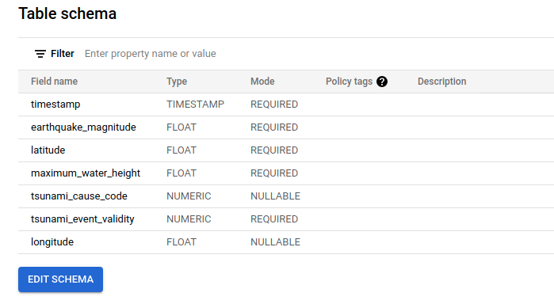
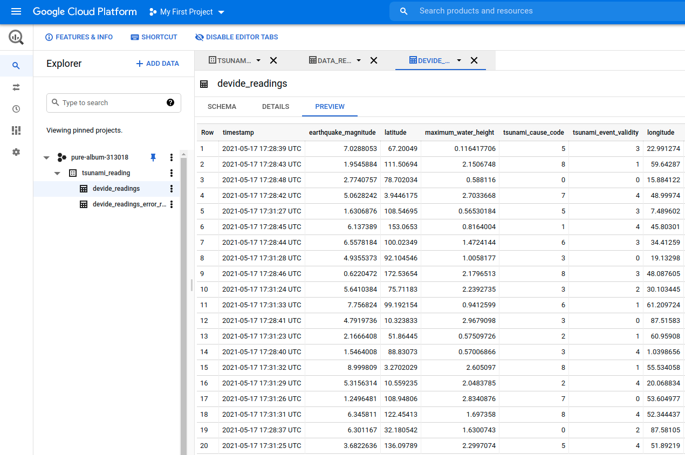
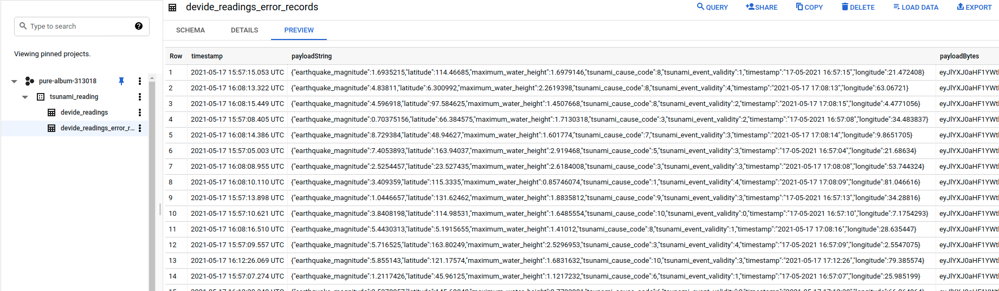

# Process and Enrich Data

## Milestone 3 - Setup Integration with the Storage Layer

### The table schema definition

### This is the data added to the table by job

Not without having some errors along the way:

**NOTE:**

Had to change the data format in simulator to `yyyy-MM-dd HH:mm:ss`, because timestamp could not be properly parsed.
