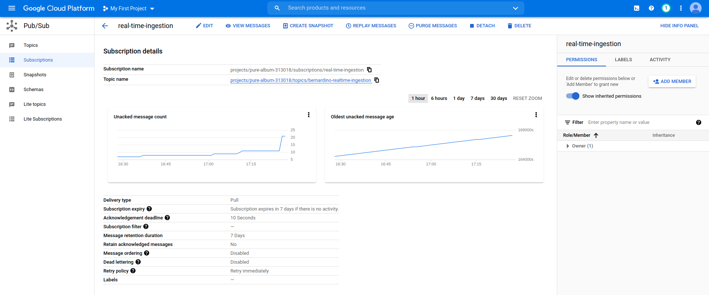

# 3. Sending events to GCP

Generated new RSA keys and configured the created device with the new public key. The private key was converted to format
PKCS #8  format, the format accepted the MQTT client to generate JWT token signed with RSA. Private key is on the root of the
project directory.

Check source code in root directory to understand how messages are being sent. Code was copied from 
[Google's IOT example](https://github.com/GoogleCloudPlatform/java-docs-samples/tree/master/iot/api-client/end-to-end-example)
and adapted.

## Subscription messages after testing application:

## Command line executed:
    mvn exec:java \
    -Dexec.mainClass="com.example.cloud.iot.endtoend.CloudiotPubsubExampleMqttDevice" \
    -Dexec.args="-project_id=pure-album-313018 \
                 -registry_id=real-time-ingestion \
                 -device_id=single \
                 -private_key_file=rsa_private.key \
                 -algorithm=RS256 \
                 -cloud_region=europe-west1 \
                 -num_messages=10"

## Output from execution:
    rsa_private.key
    Creating JWT using RS256 from private key file rsa_private.key
    Received message  on topic /devices/single/config with Qos 1
    Publishing payload {"earthquake_magnitude":2.8897922,"latitude":1.8682766,"maximum_water_height":0.0676834,"tsunami_cause_code":9,"tsunami_event_validity":4,"timestamp":"14-05-2021 17:24:18","longitude":5.4285603}
    Published message acked.
    Publishing payload {"earthquake_magnitude":4.058169,"latitude":64.82522,"maximum_water_height":1.2343225,"tsunami_cause_code":8,"tsunami_event_validity":2,"timestamp":"14-05-2021 17:24:19","longitude":5.787601}
    Published message acked.
    Publishing payload {"earthquake_magnitude":7.3654914,"latitude":84.96455,"maximum_water_height":0.7026715,"tsunami_cause_code":3,"tsunami_event_validity":2,"timestamp":"14-05-2021 17:24:20","longitude":52.064102}
    Published message acked.
    Publishing payload {"earthquake_magnitude":1.0459253,"latitude":138.19574,"maximum_water_height":1.608633,"tsunami_cause_code":11,"tsunami_event_validity":3,"timestamp":"14-05-2021 17:24:21","longitude":12.600691}
    Published message acked.
    Publishing payload {"earthquake_magnitude":9.468198E-4,"latitude":12.566224,"maximum_water_height":1.3753492,"tsunami_cause_code":0,"tsunami_event_validity":4,"timestamp":"14-05-2021 17:24:23","longitude":46.427956}
    Published message acked.
    Publishing payload {"earthquake_magnitude":1.6687326,"latitude":46.94956,"maximum_water_height":0.5041598,"tsunami_cause_code":2,"tsunami_event_validity":0,"timestamp":"14-05-2021 17:24:24","longitude":21.837795}
    Published message acked.
    Publishing payload {"earthquake_magnitude":5.1328154,"latitude":109.066315,"maximum_water_height":0.6229983,"tsunami_cause_code":5,"tsunami_event_validity":1,"timestamp":"14-05-2021 17:24:25","longitude":72.8274}
    Published message acked.
    Publishing payload {"earthquake_magnitude":8.173063,"latitude":34.209118,"maximum_water_height":2.9020538,"tsunami_cause_code":9,"tsunami_event_validity":0,"timestamp":"14-05-2021 17:24:26","longitude":69.01687}
    Published message acked.
    Publishing payload {"earthquake_magnitude":1.7720572,"latitude":167.91571,"maximum_water_height":0.16162223,"tsunami_cause_code":11,"tsunami_event_validity":4,"timestamp":"14-05-2021 17:24:27","longitude":16.949823}
    Published message acked.
    Publishing payload {"earthquake_magnitude":1.4677981,"latitude":31.077179,"maximum_water_height":0.15548748,"tsunami_cause_code":6,"tsunami_event_validity":2,"timestamp":"14-05-2021 17:24:28","longitude":82.10634}
    Published message acked.
    Finished looping successfully : mqtt.googleapis.com